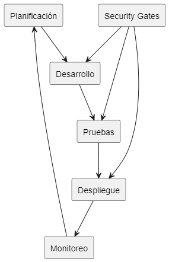

# Definición de Estrategias para Garantizar la Calidad del Producto SW

## 1. Estrategias de Aseguramiento de Calidad

### 1.1 Enfoque DevSecOps para el Expediente Fiscal Electrónico


- **Integración Continua**: Implementación de pipelines CI/CD específicos para cada módulo (Denuncia, Evaluación, Investigación, Acusación)
- **Automatización de Despliegues**: Con entornos espejo para simular condiciones de fiscalías rurales y urbanas
- **Verificación Estática de Código**: Con énfasis en patrones de seguridad para sistemas judiciales

## 2. Estrategias de Pruebas Especializadas

### 2.1 Matriz de Pruebas por Dominio Judicial

| Nivel | Tipo de Prueba | Enfoque | Herramientas |
|-------|---------------|---------|--------------|
| Unitarias | Validación de reglas procesales | Tests automatizados por módulo | JUnit/Jest |
| Integración | Flujo procesal completo | Pruebas de integración entre módulos | Postman/SoapUI |
| Sistema | Simulación de casos judiciales | Pruebas end-to-end de procesos completos | Selenium/Cypress |
| Aceptación | Validación con fiscales reales | Sesiones guiadas con usuarios finales | TestRail |

### 2.2 Estrategia de Pruebas No Funcionales

- **Pruebas de Carga**: Simulación de volumen de denuncias en periodos críticos
- **Pruebas de Seguridad**: Evaluación OWASP Top 10 con énfasis en confidencialidad de expedientes
- **Pruebas de Recuperación**: Simulación de fallas durante etapas críticas del proceso judicial
- **Pruebas de Accesibilidad**: Conformidad con estándares WCAG para garantizar acceso universal

## 3. Control de Calidad de Datos Judiciales

### 3.1 Validación y Verificación de Integridad

- **Validación Jurídica**: Implementación de validadores especializados para documentos legales
- **Consistencia de Datos**: Verificación de integridad entre etapas procesales
- **Trazabilidad Completa**: Auditoría de cada acción realizada sobre expedientes
- **Firmas Digitales**: Validación criptográfica de documentos oficiales

### 3.2 Calidad de Base de Datos

- **Normalización Optimizada**: Esquemas optimizados para búsquedas judiciales frecuentes
- **Gestión de Datos Maestros**: Para entidades como juzgados, fiscalías y códigos penales
- **Indexación Especializada**: Para búsqueda eficiente de precedentes y jurisprudencia
- **Archivado Legal**: Políticas de retención conforme a normativa procesal vigente

## 4. Aseguramiento de Calidad en Producción

### 4.1 Monitoreo Proactivo

- **Observabilidad End-to-End**: Seguimiento de KPIs procesales (tiempos de respuesta, resolución de casos)
- **Alertas Tempranas**: Detección de anomalías en flujos de trabajo judiciales
- **APM Especializado**: Monitoreo de rendimiento en puntos críticos del proceso judicial

### 4.2 Mejora Continua

- **Análisis de Incidentes**: Metodología de causa raíz para fallos en procesos judiciales
- **Retroalimentación Estructurada**: Sesiones periódicas con fiscalías y juzgados
- **Métricas de Calidad**: Dashboard de indicadores de efectividad del sistema judicial

## 5. Estrategias de Validación Legal y Cumplimiento

- **Revisión por Expertos Legales**: Validación de conformidad con códigos procesales
- **Auditorías de Compliance**: Verificación periódica de cumplimiento normativo
- **Simulacros de Auditoría**: Preparación para inspecciones de órganos de control judicial
- **Ethical Hacking**: Evaluación de posibilidades de manipulación de expedientes

## 6. Gestión de Riesgos de Calidad

```
┌──────────────────┐  ┌──────────────────┐  ┌──────────────────┐
│ Identificación   │  │ Evaluación       │  │ Mitigación       │
│ - Mapa de riesgos│  │ - Matriz impacto │  │ - Plan de acción │
└──────────────────┘  └──────────────────┘  └──────────────────┘
```

- **Análisis FMEA**: Para cada etapa crítica del proceso judicial
- **Plan de Contingencia**: Para escenarios de fallos en etapas críticas (ej. formalización de acusación)
- **Gestión de Cambios**: Procedimientos reforzados para modificaciones en módulos sensibles

La implementación de estas estrategias permitirá garantizar un Expediente Fiscal Electrónico con la confiabilidad, disponibilidad e integridad necesarias para transformar el sistema judicial, reduciendo la impunidad y aumentando la transparencia del proceso judicial.