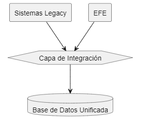

# Identificación de Desafíos Técnicos y Organizacionales para la Implementación del EFE

## 1. Desafíos Técnicos

### 1.1 Integración de Sistemas Heterogéneos


- **Fragmentación actual**: Los sistemas de las diferentes instancias judiciales (fiscalías, juzgados, policía) operan como silos de información sin interfaces estandarizadas
- **Migración de datos históricos**: Conversión y validación de expedientes físicos y digitales dispersos en múltiples formatos
- **Creación de APIs transversales**: Desarrollo de interfaces que respeten las particularidades de cada entidad mientras mantienen coherencia global

### 1.2 Seguridad y Confidencialidad

- **Protección de datos sensibles**: Implementación de cifrado multinivel para información judicial reservada
- **Manejo de múltiples niveles de acceso**: Gestión granular de permisos según rol y jurisdicción
- **Amenazas cibernéticas específicas**: Protección contra ataques dirigidos a manipular procesos judiciales
- **Trazabilidad forense**: Registro inmutable de cada interacción con expedientes sensibles

### 1.3 Infraestructura y Accesibilidad

| Contexto | Desafíos Específicos | Estrategias Potenciales |
|----------|----------------------|------------------------|
| Urbano | Alta concurrencia, ataques sofisticados | Infraestructura cloud híbrida, balanceo de carga |
| Rural | Conectividad intermitente, energía inestable | Modelo offline-first, sincronización diferida |
| Remoto | Ausencia total de conectividad | Unidades móviles, satelital, puntos de conexión comunitarios |

- **Brecha digital**: Accesibilidad para comunidades nativas y zonas con infraestructura limitada
- **Continuidad operativa**: Garantía de servicio ininterrumpido ante desastres naturales frecuentes en la región

## 2. Desafíos Organizacionales

### 2.1 Gestión del Cambio Cultural

```
┌─────────────────────────┐      ┌─────────────────────────┐      ┌─────────────────────────┐
│    Resistencia Inicial  │ ───> │ Capacitación Progresiva │ ───> │   Adopción Completa     │
└─────────────────────────┘      └─────────────────────────┘      └─────────────────────────┘
```

- **Adaptación procesal**: Transición de procedimientos basados en papel a flujos de trabajo digitales
- **Resistencia institucional**: Superación de inercias administrativas y temores al control de transparencia
- **Curva de aprendizaje**: Capacitación efectiva de personal con diversos niveles de alfabetización digital
- **Choque generacional**: Conciliación entre funcionarios veteranos y nuevas generaciones nativas digitales

### 2.2 Coordinación Interinstitucional

- **Armonización de procedimientos**: Estandarización de procesos entre fiscalías, juzgados y policía
- **Gobernanza del proyecto**: Establecimiento de mecanismos de decisión que equilibren diversas jurisdicciones
- **Conflictos de competencia**: Resolución de disputas sobre propiedad y acceso a información compartida
- **Integración con entidades externas**: Coordinación con registros civiles, medicina legal y servicios penitenciarios

### 2.3 Marco Normativo y Legislativo

- **Adecuación legal**: Modificación de leyes procesales para validar documentos electrónicos
- **Protección de datos personales**: Cumplimiento de regulaciones de privacidad sin obstaculizar la transparencia
- **Firma digital avanzada**: Implementación de marco legal para validez jurídica de acciones electrónicas
- **Reglamentación técnica**: Desarrollo de estándares técnicos con rango normativo

## 3. Desafíos Sociopolíticos

### 3.1 Presiones Externas e Internas

- **Intereses creados**: Resistencia de actores beneficiados por la opacidad del sistema actual
- **Presión mediática**: Manejo de expectativas públicas sobre resultados inmediatos
- **Sostenibilidad política**: Continuidad del proyecto ante cambios de administración gubernamental
- **Influencia indebida**: Protección de la independencia del desarrollo frente a presiones de grupos de poder

### 3.2 Particularidades Regionales

- **Diversidad lingüística**: Adaptación para comunidades que no hablan español como primera lengua
- **Respeto a usos y costumbres**: Compatibilidad con sistemas de justicia indígena reconocidos constitucionalmente
- **Zonas de conflicto**: Implementación en regiones con presencia de crimen organizado o conflicto armado
- **Desconfianza histórica**: Superación de la desconfianza de comunidades tradicionalmente marginadas

## 4. Desafíos de Implementación y Sostenibilidad

### 4.1 Gestión de Proyecto

- **Escala nacional**: Coordinación de despliegue en múltiples jurisdicciones con realidades heterogéneas
- **Cronograma político vs. técnico**: Equilibrio entre presiones por resultados rápidos y necesidad de desarrollo robusto
- **Gestión de riesgos**: Preparación para contingencias en un proyecto de alta visibilidad pública
- **Transición gradual**: Diseño de estrategia de migración que permita operación dual durante la transición

### 4.2 Sostenibilidad a Largo Plazo

- **Modelo de financiación**: Aseguramiento de recursos para mantenimiento tras agotarse fondos iniciales
- **Capacidad técnica interna**: Desarrollo de talento local que reduzca dependencia de proveedores externos
- **Evolución tecnológica**: Diseño de arquitectura que permita actualización sin reemplazo completo
- **Transferencia de conocimiento**: Documentación exhaustiva que sobreviva a rotación de personal técnico

Este análisis de desafíos permite anticipar los obstáculos que enfrentará la implementación del Expediente Fiscal Electrónico en múltiples dimensiones, facilitando el desarrollo de estrategias preventivas y correctivas que aumenten las probabilidades de éxito del proyecto en el complejo ecosistema judicial latinoamericano.